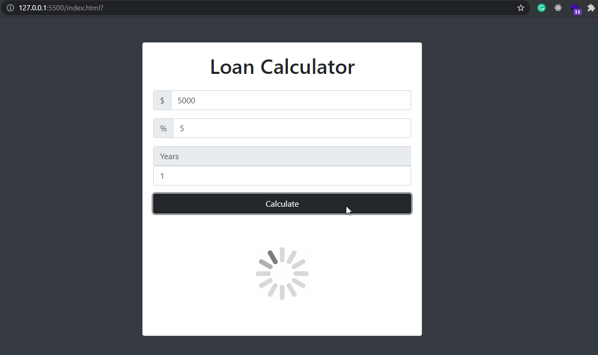
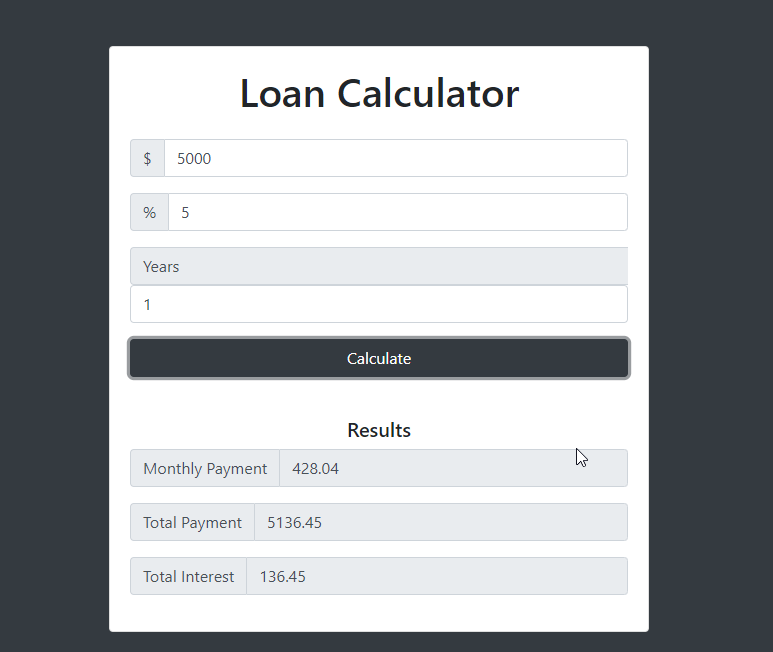

# Loan-Calculator

This project is a simple project to practice DOM Manipulation using pure JavaScirpt.

Ther user can calculate the monthly return for an amount of loan with a user specific interest rate and return time(in years). 

The results will be shown after the calculation and a loading spinner. 

